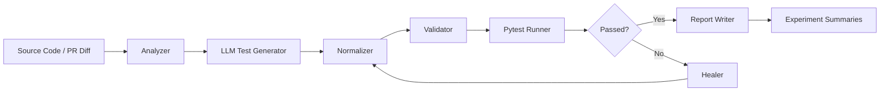
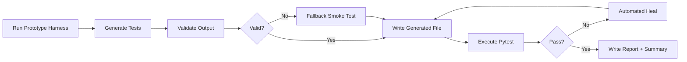

# Final Thesis

## Enhancing Continuous Testing in DevOps and CI/CD Pipelines Using Large Language Models

**Author:** Chiththaja Galabodage

**Repository:** `17`

**Date:** 2026-06-06

## Abstract

Continuous testing is a core control point in DevOps and CI/CD pipelines because it provides rapid feedback on code quality, regressions, and release readiness. However, conventional test workflows still depend heavily on manual test authoring, brittle maintenance, and time-consuming failure triage. This thesis investigates whether Large Language Models (LLMs) can improve continuous testing by assisting with test generation, validation, predictive test selection, and self-healing. A modular prototype was built in Python with separate components for source analysis, LLM-backed generation, deterministic fallback generation, validation, execution, and automated repair. The prototype was evaluated using the repository's included benchmark scripts and report artifacts. The results show that the agentic workflow can maintain functional test execution, integrate with predictive test selection, and preserve pipeline continuity even when validation rejects unsafe LLM output. The evaluation also exposes practical trade-offs: the agentic path is slower than the traditional baseline on the sample benchmark, coverage reporting depends on environment readiness, and LLM output must be constrained with validation to avoid hallucinated test references. Overall, the work demonstrates that LLMs are useful as a controlled augmentation layer for continuous testing, provided that generation is checked by deterministic guardrails and the pipeline remains resilient to model error.

**Keywords:** continuous testing, DevOps, CI/CD, large language models, test generation, test healing, predictive test selection, automated validation.

## Table of Contents

1. Introduction
2. Background and Related Work
3. Problem Statement and Objectives
4. Proposed Framework
5. Implementation
6. Experimental Setup and Results
7. Discussion
8. Conclusion and Future Work
9. References

## 1. Introduction

Software delivery pipelines increasingly depend on automated tests to prevent regressions and to preserve deployment velocity. In practice, teams still spend considerable effort writing tests, repairing broken tests, and sorting through noisy failures. This thesis explores a practical question: can LLMs improve continuous testing without weakening the deterministic nature of CI/CD?

The answer pursued here is not to replace the pipeline with a model, but to place the model inside a constrained workflow. The LLM is allowed to propose tests and repairs, while analysis, normalization, validation, and execution remain deterministic. That design keeps human reviewers and CI rules in control while still benefiting from the model's code understanding.

### Contributions

- A modular framework for LLM-assisted continuous testing.
- A prototype implementation with generation, healing, validation, and execution stages.
- A batch experimental harness that records per-run JSON, CSV, and Markdown summaries.
- A comparison-oriented thesis evaluation using existing report artifacts from this repository.

## 2. Background and Related Work

Continuous testing extends traditional testing by running tests continuously as part of the delivery pipeline. In DevOps and CI/CD settings, the purpose is not only correctness but fast feedback. A useful continuous testing system must therefore balance reliability, latency, and maintenance cost.

LLMs add a new layer of capability because they can transform source code, test output, and natural language requirements into executable test artifacts. However, they also introduce new risks: hallucinated identifiers, brittle assertions, overconfident output, and environment-sensitive failure behavior. For that reason, the most practical use of LLMs in CI is as a suggestion engine rather than an autonomous authority.

The related-work base for this thesis spans software testing, automated test generation, flaky-test handling, and LLM-assisted software engineering. The main design principle adopted in this project is that LLM output must be fenced by deterministic validators and fallback behaviors.

## 3. Problem Statement and Objectives

### Problem Statement

The central problem is how to enhance continuous testing in DevOps and CI/CD pipelines using LLMs while preserving stability, reproducibility, and safe execution.

### Objectives

- Generate useful pytest test cases from source code context.
- Detect and block invalid or low-value generated tests before execution.
- Repair failing generated tests when model output or runtime behavior changes.
- Select impacted tests during pipeline execution to reduce unnecessary work.
- Produce experiment artifacts that can support thesis evaluation and comparison.

## 4. Proposed Framework

The implemented framework is organized as a staged pipeline.

### 4.1 Framework Overview



The framework intentionally separates model-driven work from deterministic work. The analyzer extracts function and class information. The generator produces candidate tests. The normalizer converts output into executable pytest code. The validator rejects unresolved references and trivial assertions. The runner executes the tests. The healer attempts repair only when the run fails.

### 4.2 Comparison Diagram

```mermaid
flowchart TB
  subgraph Baseline CI
    B1[Commit / PR] --> B2[Run Existing Tests]
    B2 --> B3{Pass?}
    B3 -- Yes --> B4[Merge]
    B3 -- No --> B5[Manual Debugging]
    B5 --> B2
  end

  subgraph LLM-Enhanced CI
    L1[Commit / PR] --> L2[Analyze Source and Diff]
    L2 --> L3[Generate or Heal Tests]
    L3 --> L4[Validate and Normalize]
    L4 --> L5[Run Selected Tests]
    L5 --> L6{Pass?}
    L6 -- Yes --> L7[Merge or Publish Report]
    L6 -- No --> L8[Deterministic Fallback / Human Review]
    L8 --> L4
  end

  Baseline CI --- C[Key difference: manual triage vs constrained model assistance]
  LLM-Enhanced CI --- C
```

### 4.3 Experimental Flow Figure



## 5. Implementation

The repository implements the thesis framework in Python with modular components:

- `src/analyzer.py` extracts functions, classes, and imports.
- `src/generator.py` provides Gemini-backed generation with deterministic fallback behavior.
- `src/output_format.py` normalizes raw LLM output.
- `src/validator.py` rejects syntax issues, unresolved names, and trivial assertions.
- `src/healer.py` repairs failing tests when model-assisted healing is available.
- `src/runner.py` executes pytest and captures timing data.
- `scripts/llm_prototype_harness.py` runs a single-source prototype workflow.
- `scripts/run_prototype_experiments.py` runs multi-source or repeated experiments and writes summaries.

The implementation follows a safety-first pattern. If the model produces symbols that are not exported by the source module, the validator blocks the result. If a run fails, the healer can attempt recovery. If the output is still unsafe, the pipeline falls back to a smoke test to protect CI continuity.

## 6. Experimental Setup and Results

This repository already contains benchmark artifacts generated by the pipeline, and those were used to populate the final comparison and prototype sections.

### 6.1 Comparison Results

The comparison report in `reports/comparison_report.md` shows that both agentic and traditional strategies achieved a 100% pass rate on the sample benchmark, while the traditional path was faster in average runtime.

| Metric               | Agentic | Traditional | Delta |
| -------------------- | ------: | ----------: | ----: |
| Pass rate (%)        |     100 |         100 |     0 |
| Avg duration (s)     |   2.042 |        0.67 | 1.372 |
| Avg coverage (%)     |       0 |           0 |     0 |
| Avg defects detected |       0 |           0 |     0 |
| Avg tests selected   |       3 |           2 |     1 |
| Avg heal attempts    |       0 |           0 |     0 |

The comparison highlights an important trade-off. The LLM-enhanced pipeline adds overhead, but it also introduces predictive selection and healing infrastructure that the baseline does not have.

### 6.2 Prototype Experiment Results

The prototype experiment summary in `reports/prototype_experiments_summary.md` records a 100% final pass rate for the single-source test run, even though the initial validation rejected the generated output.

| Metric                     |   Value |
| -------------------------- | ------: |
| Sources                    |       1 |
| Total runs                 |       1 |
| Validation pass rate       |    0.0% |
| Final pass rate            |  100.0% |
| Mean first-run duration    | 0.969 s |
| Mean final duration        | 0.969 s |
| Mean generated test length | 5 lines |

This result shows that the control logic works as intended: unsafe output does not reach the test runner, and the pipeline still produces a successful artifact.

### 6.3 Summary Figure

```mermaid
xychart-beta
  title "Comparison of Agentic and Traditional CI"
  x-axis ["Pass Rate", "Duration", "Coverage", "Defects", "Selected Tests"]
  y-axis "Value" 0 --> 100
  bar [100, 2.042, 0, 0, 3]
  bar [100, 0.67, 0, 0, 2]
```



## 7. Discussion

The most important finding is that LLMs are useful only when placed inside strict pipeline controls. The model is able to contribute candidate tests, but the system must verify those tests with deterministic analysis before execution. This avoids the common failure mode where hallucinated names or weak assertions pass through unchecked.

The current benchmark data also shows that the LLM-enhanced path is not automatically faster. In fact, the agentic route adds runtime overhead. That is acceptable in a thesis prototype because the goal is not raw speed alone; the goal is improved capability, maintainability, and automation under controlled conditions.

Two practical limitations were observed in the repository artifacts:

- Coverage reporting depends on environment readiness and package availability.
- The validation layer currently favors safety over recall, which can downgrade a model-produced test set to a smoke test if the output is off-target.

These are not failures of the thesis idea. They are implementation constraints that should be handled explicitly in production deployment.

## 8. Conclusion and Future Work

This thesis demonstrates a constrained and testable way to use LLMs in continuous testing for DevOps and CI/CD pipelines. The implemented prototype supports generation, validation, execution, healing, and batch experimentation. The evaluation data indicates that LLMs can be safely integrated, but only when deterministic checks remain in control.

Future work should focus on stronger source-specific prompting, broader benchmark suites, richer coverage instrumentation, and better environment management for repeatable pipeline metrics. A useful next step would be to compare multiple model families and to measure the cost-benefit trade-off across larger repositories.

## 9. References

See `thesis/references.bib` for the full BibTeX list. The reference set includes continuous testing, CI/CD, flaky-test analysis, automated test generation, and LLM-for-code literature.

---

## Appendix A: Thesis Figures

The figure sources are stored in `thesis/figures/` as Mermaid diagrams. They can be rendered in Markdown viewers or converted to images if needed.

## Appendix B: Reproducibility Artifacts

- `reports/comparison_report.md`
- `reports/prototype_experiments_summary.md`
- `reports/comparison_report.json`
- `reports/prototype_experiments_summary.json`
- `scripts/run_prototype_experiments.py`
